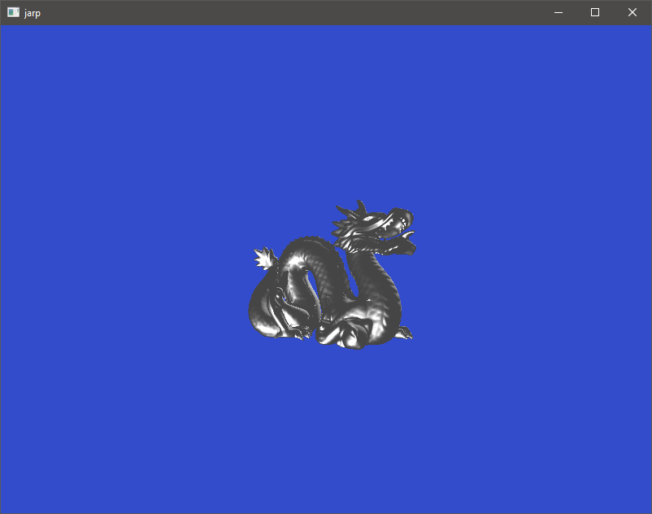

# jarp

This is Just Another Rendering Project.
The whole purpose of it is to understand vulkan, rendering and all that beautiful stuff a little better and see where we're ending at.

## Getting up and running

### Windows

- Install the [Vulkan SDK](https://vulkan.lunarg.com/sdk/home#sdk/downloadConfirm/1.1.126.0/windows/VulkanSDK-1.1.126.0-Installer.exe) under `C:\VulkanSDK`.
- Execute `GenerateProjectFiles_VS2019.bat` and start the generated Visual Studio solution.

### Linux

- Install SDL2. 

```bash
# Installation of components needed for building the project
> sudo apt install libsdl2-dev
```

- Install the Vulkan SDK.

```bash
# Vulkan SDK installation
> wget -qO - http://packages.lunarg.com/lunarg-signing-key-pub.asc | sudo apt-key add - \
    sudo wget -qO /etc/apt/sources.list.d/lunarg-vulkan-1.1.126-bionic.list http://packages.lunarg.com/vulkan/1.1.126/lunarg-vulkan-1.1.126-bionic.list \
    sudo apt update \
    sudo apt install vulkan-sdk

# Debugging symbols installation
> sudo apt install libvulkan1-dbgsym vulkan-tools-dbgsym

# Vulkan loader source installation
> apt source libvulkan1
```

- Execute `GenerateProjectFiles.sh` to create the Makefiles.
- Run the command `make`.

## Supported Platforms

- Windows 64-bit

## Dependencies
### General

- glm *0.9.9.5*
- spdlog *1.3.1*
- stb *@052dce1*
- tinyobjloader *2.0-rc1*
- volk *@453c4de*
- **Vulkan SDK** *1.1.126* (needs to be installed on your system)

### Windows

- SDL2 *2.0.9*

### Linux

- SDL2 *2.0*

## How it looks right now


